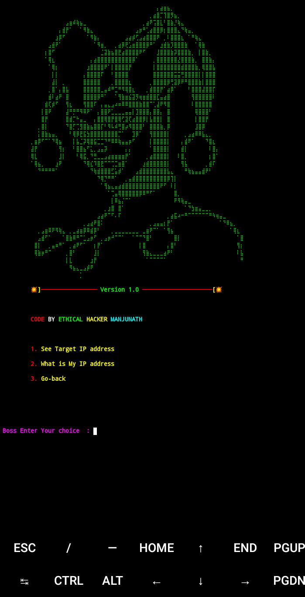
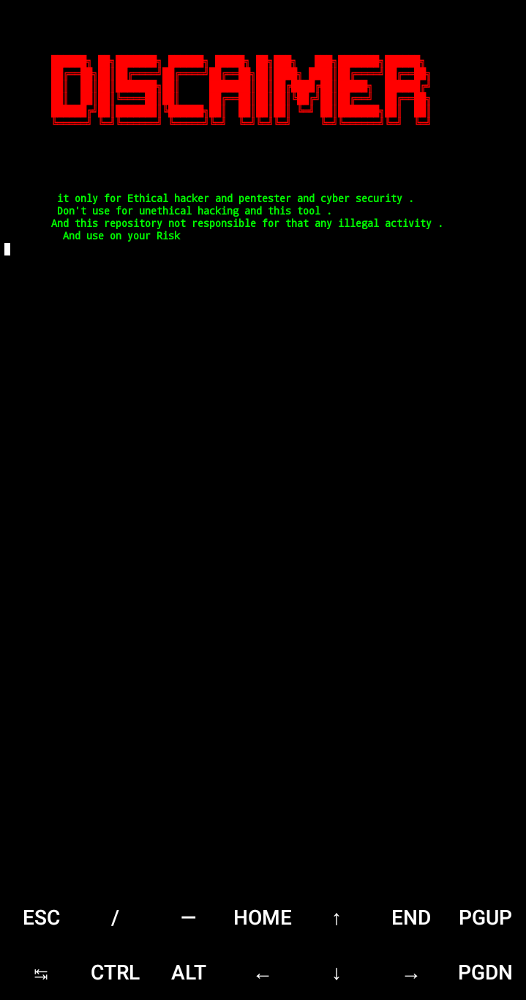

# I-Killer
I-Kiler in a ip Tracking Tool For ( Ethical hacking) and ( Cyber Security )



# Disclaimer
it only for Ethical hacker and pentester Don't use for unethical hacking and this tool and this repository not responsible for that any illegal activity  .


# This Tool Tested On :

- Kali Linux

- Termux

- ARCH Linux 

- userland 

- Ubuntu 

- Parrot OS

- Blackarch Linux

- Debian OS

Added live host Identification and server live Identification 

#  💿  Installation On Ubuntu and Kali and parrot os  ... 💿
```bash
sudo apt update && apt upgrade -y
```
```bash
sudo apt-get install git -y
```

```bash
git clone https://github.com/Dark-Legends/I-killer
```

```bash
cd I-Killer
```
```bash
chmod +x install.sh 
```
```bash
./ip-killer
```
Usage: i-killer [OPTIONS]
Options:
  --help      Help Command Info
  --version   Version Command Information
  
#   💿  Installation On Termux and userland app ...  💿
```bash
apt update 
```
```bash
apt upgrade -y
```

```bash
apt install git -y
```

```bash
git clone https://github.com/Dark-Legends/I-killer
```
```bash
cd I-killer
```

```bash
chmod +x install.sh
```
```bash
./ip-killer
```

Usage: i-killer [OPTIONS]
Options:
  --help      Help Command Info
  --version   Version Command Information
